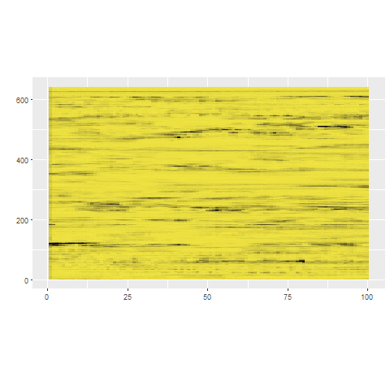
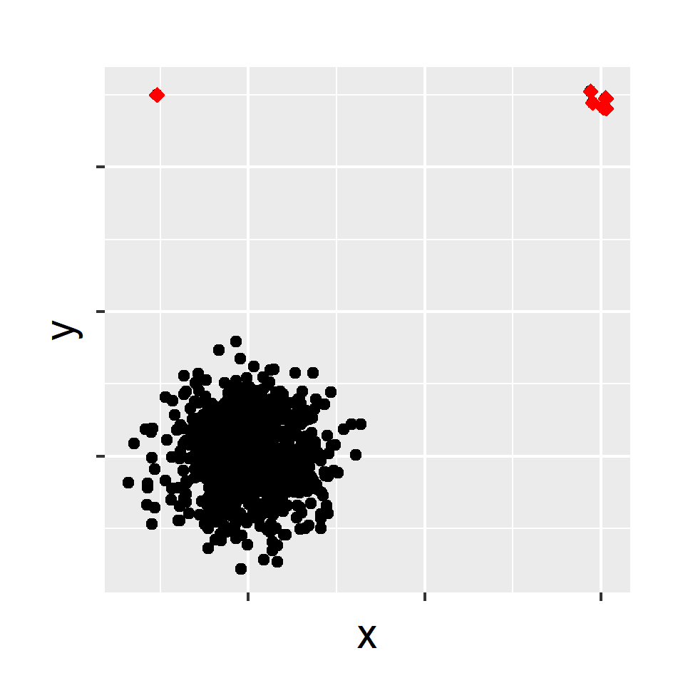
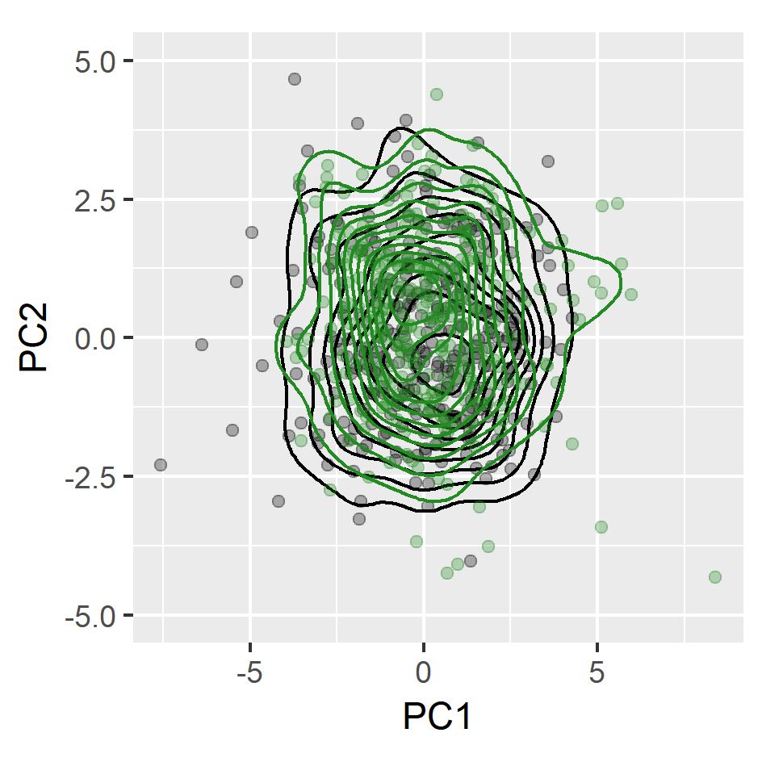
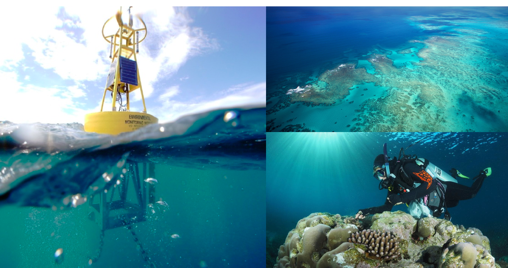

```{r setup, include=FALSE}
options(htmltools.dir.version = FALSE)
knitr::opts_chunk$set(
  fig.width=9, fig.height=3.5, fig.retina=3,
  out.width = "100%",
  cache = FALSE,
  echo = FALSE,
  message = FALSE, 
  warning = FALSE,
  hiline = TRUE
)
```

```{r xaringan-themer, include=FALSE, warning=FALSE}
library(xaringanthemer)
style_mono_accent(
   base_color = "#010333",
    title_slide_background_image = "fig/title.jpeg",
   title_slide_background_color = "#010333",
  inverse_background_color = "#02054a", #"#002c54"
  header_font_google = google_font("Josefin Sans"),
  text_font_google   = google_font("Montserrat", "500", "500i"),
  code_font_google   = google_font("Fira Mono"),
  title_slide_text_color = "lightgreen",
  inverse_header_color = "#ffbb0f",
  header_background_text_color = "lightgreen",
  inverse_text_color = "#ffbb0f",
  base_font_size = "20px",
  text_font_size = "1.3rem",
  header_h1_font_size = "3rem",
  header_h2_font_size = "2rem",
  header_h3_font_size = "2rem",
  )
```

class: center, middle, inverse

# Anomaly Detection


---
class: center, middle
.pull-left[ 
### High Dimensional data 

```{r echo=FALSE, out.width = "90%"}

```
]
--
.pull-right[
### Temporal data

```{r echo=FALSE, out.width = "90%"}
knitr::include_graphics("fig/2_outtypeb2.png")
```
]

---

class: center, middle, inverse

# Monitoring Systems in Engineering in the Information Age


---

background-image:url('fig/sydney.jpeg')
background-position: 50% 10%
background-size: 100%
class: left, top, clear


---

background-image:url('fig/2_sydney22.png')
background-position: 80% 50%
background-size: 100%
class: left, top, clear


---

background-image:url('fig/condition.png')
background-position: 80% 50%
background-size: 100%
class: left, top, clear

---

background-image:url('fig/app1.png')
background-position: 80% 50%
background-size: 100%
class: left, top, clear


---

background-image:url('fig/app2.png')
background-position: 80% 50%
background-size: 100%
class: left, top, clear


---
background-image:url('fig/4_outtype2.png')
background-position: 50% 70%
background-size:80%
class: left, top, clear

## Anomalies in temporal data
---
- Approaches to solving the problem of anomaly detection for temporal data :
--
.pull-left[
### Batch scenario 
- Whole set of data is available
- Complete events <br/><br/><br/>

```{r mvtsplot, out.width = "100%",  fig.align = 'bottom',echo=FALSE}
knitr::include_graphics("fig/6_batch.png")
```
]
--
.pull-right[
### Data stream scenario
- Continuous, unbounded, flow at high speed, high volume
- Incomplete events
```{r  echo=FALSE, out.width = "100%", fig.align = 'up'}

```
]
---
background-image:url('fig/stray.png')
background-position: 80% 50%
background-size: 100%
class: left, top, clear


---

## Anomaly detection in high dimensional Data


### What is an anomaly ?
- We define an anomaly as an observation that deviates markedly from the majority with a  <span style="color:red"> large distance gap. </span>
--


### Main assumptions
- There is a large distance between typical data and the anomalies in comparison to the distance among typical data.

---

## stray

```{r  echo=FALSE, out.width = "50%", fig_align = 'top', fig.align = 'center'}
knitr::include_graphics("fig/9_stray_plot1.png")
```
-  Normalize the columns of the data. (median and IQR)
-  This prevents variables with large variances having disproportional influence on Euclidean distances.
---

## Why not "nearest neighbour" distances? 
```{r  echo=FALSE, out.width = "50%", fig_align = 'top', fig.align = 'center'}
knitr::include_graphics("fig/9_stray_plot2.png")
```

- Calculate the nearest neighbour distance 
---
## stray -  "k- nearest neighbour" distances 
```{r  echo=FALSE, out.width = "50%", fig_align = 'top', fig.align = 'center'}
knitr::include_graphics("fig/9_stray_plot5.png")
```


- Select the <span style="color:red"> k nearest neighbour </span> distance with the <span style="color:red"> maximum gap </span>
---
#### Calculate anomalous threshold

- Use extreme value theory (EVT) to calculate a data driven outlier threshold.

```{r  echo=FALSE, out.width = "40%", fig_align = 'top', fig.align = 'center'}
knitr::include_graphics("fig/evt.png")
```

---
**Spacing theorem (Weissman, 1978)**

.pull-left[

Let $X_{1}, X_{2}, ..., X_{n}$ be a sample from a distribution function $F$ . </br>
Let $X_{1:n} \geq X_{2:n} \geq ... \geq X_{n:n}$ be the order statistics. </br>
The available data are $X_{1:n}, X_{2:n},  ..., X_{k:n}$ for some fixed $k$. </br>
Let $D_{i,n} = X_{i:n} - X_{i+1:n},$ $(i = 1,2,..., k)$ be the spacing between successive order statistics.</br>
If $F$ is in the maximum domain of attraction of the Gumbel distribution, then the spacings $D_{i,n}$ are asymptotically independent and exponentially distributed with mean proportional to $i^{-1}$.
].pull-right[
```{r  echo=FALSE, out.width = "100%", fig_align = 'top'}
knitr::include_graphics("fig/10_spacingTheorem.png")
```
]

---

## stray
```{r  echo=FALSE, out.width = "50%", fig_align = 'top', fig.align = 'center'}

```

`outliers <- find_HDoutliers(data)` <br/>
`display_HDoutliers(data, outliers)`
---

background-image:url('fig/4_outtype2.png')
background-position: 50% 70%
background-size:80%
class: left, top, clear

## Anomalies in temporal data
---
## Feature based representation of time series
.pull-left[
- Mean   

- Variance  

- Changing variance in remainder 

- Level shift using rolling window  

- Variance change  

- Strength of linearity 

- Strength of curvature  
 ]

.pull-right[
- Strength of spikiness 

- Burstiness of time series (Fano Factor) 

- Minimum  

- Maximum  

- The ratio between 50% trimmed mean and the arithmetic mean

- Moment 

- Ratio of means of data that is below and above the global mean  

]
---
### Approach 1: Using stray

- use a moving window to deal with streaming data

- Extract time series features from window

- Apply stray algorithm to identify anomalous series

.pull-left[

```{r   echo=FALSE, out.width = "80%"}
knitr::include_graphics("fig/12_strayts.png")
```

]
.pull-right[
```{r   echo=FALSE, out.width = "50%"}

```
]


---
class:: center, clear
.pull-left[
 
```{r   echo=FALSE, out.width = "75%"}
knitr::include_graphics("fig/14_P2_plot21a.png")
```
]
--
.pull-right[

```{r   echo=FALSE, out.width = "75%"}
knitr::include_graphics("fig/14_P2_plot21b.png")
```
]

---


background-image:url('fig/fftdata.png')
background-position: 50% 50%
background-size: 100%
class: left, top, clear
---

.pull-left[
### Feature Based Representation of Time series


```{r   echo=FALSE, out.width = "110%", fig_align = 'bottom'}
knitr::include_graphics("fig/6_batch.png")
```


]
.pull-right[
```{r  echo=FALSE, out.width = "90%",}
knitr::include_graphics("fig/22_tsfeatures.png")
```
]


---

class:: center, clear
.pull-left[
 
```{r   echo=FALSE, out.width = "75%"}
knitr::include_graphics("fig/14_P2_plot21a.png")
```
].pull-right[

```{r   echo=FALSE, out.width = "75%"}
knitr::include_graphics("fig/14_P2_plot21b.png")
```
]

---
background-image:url('fig/oddstreampaper.png')
background-position: 50% 50%
background-size: 100%
class: left, top, clear

---
## Dimension reduction for time series 

.pull-left[
`load(train_data)`
```{r   echo=FALSE, out.width = "100%", fig_align = 'bottom'}
knitr::include_graphics("fig/16_typical.png")
```
]
--
.pull-right[
`tsfeatures <- oddstream::extract_tsfeatures`</br>`(train_data)`

```{r  echo=FALSE, out.width = "60%",}
knitr::include_graphics("fig/17_high_typical.gif")
```
]

---

.pull-left[
`tsfeatures <- oddstream::extract_tsfeatures`</br>`(train_data)`

```{r  echo=FALSE, out.width = "70%",}
knitr::include_graphics("fig/17_high_typical.gif")
```
]
--
.pull-right[
`pc<- oddstream::get_pc_space(tsfeatures)`</br>
`oddstream::plotpc(pc$pcnorm)` 
```{r  echo=FALSE, out.width = "90%",}


```
]
---
## Anomalous threshold calculation 

- Estimate the probability density function of the 2D PC space $\longrightarrow$ Kernel <span style="color:red"> density estimation</span>


- Draw a large number N of extremes $(arg min_{x\in X}[f_{2}(x)])$ from the estimated probability density function


- Define a $\Psi$-transform space, using the $\Psi$-transformation defined by (Clifton et al., 2011)

```{r   echo=FALSE, out.width = "50%"}
knitr::include_graphics("fig/19_psitrans.png")
```

- $\Psi$-transform maps the density values back into space into which a Gumbel distribution can be fitted.


- Anomalous threshold calculation $\longrightarrow$ <span style="color:red"> extreme value theory </span>


---
class: center, top, clear
`oddstream::find_odd_streams(train_data, test_stream)`
```{r   echo=FALSE, out.width = "40%"}
knitr::include_graphics("fig/19_oddstream_mvtsplot.gif")
```
.pull-left[
```{r  echo=FALSE, out.width = "60%", fig_align = 'top'}
knitr::include_graphics("fig/20_oddstream_out_loc.gif")
```
]
.pull-right[
```{r  echo=FALSE, out.width = "60%", fig_align = 'top'}
knitr::include_graphics("fig/21_oddstream_pcplot.gif")
```
]
---

class:  center, middle, inverse


# Adaptive Anomaly Detection

## Managing <span style="color:red">Concept Drift </span>  in Data Streams

---

background-image:url('fig/23_nonstationaritytypes.png')
background-position: 50% 50%
background-size: 50%
class: left, top, clear

---

class:  center, middle

```{r  echo=FALSE, out.width = "85%", fig_align = 'top', out.height="10%"}
knitr::include_graphics("fig/24_suddenplot2.png")
```

```{r  echo=FALSE, out.width = "30%", fig_align = 'top'}
knitr::include_graphics("fig/25_noCD1.png")
```
---

class:  center, middle

```{r  echo=FALSE, out.width = "85%", fig_align = 'top', out.height="10%"}
knitr::include_graphics("fig/26_suddenplot3.png")
```

```{r  echo=FALSE, out.width = "30%", fig_align = 'top'}

```

---

class:  center, middle

```{r  echo=FALSE, out.width = "85%", fig_align = 'top',  out.height="10%"}
knitr::include_graphics("fig/28_suddenplot4.png")
```

```{r  echo=FALSE, out.width = "30%", fig_align = 'top'}
knitr::include_graphics("fig/29_noCD3.png")
```

---

class:  center, middle
**Managing Concept Drift Through Adaptive Anomaly Detection**

```{r  echo=FALSE, out.width = "70%", fig_align = 'top', out.height="10%"}
knitr::include_graphics("fig/30_suddenplot2.png")
```

```{r  echo=FALSE, out.width = "80%", fig_align = 'top'}
knitr::include_graphics("fig/31_conceptdrift_pval.png")
```

$$H_{0} : f_{t_{0}} = f_{t_{t}}$$


- squared discrepancy measure $T = \int[f_{t_{0}}(x) - f_{t_{t}}(x)]^{2}dx$ (Anderson et al., 1994)

---


background-image:url('fig/2_outtypeb.png')
background-position: 50% 70%
background-size:100%
class: left, top, clear

## Anomalies in temporal data
---

## Technical issues in sensor equipments

This work is part of a collaborative research project with Queensland University of Technology, the <span style="color:red"> Queensland Department of Environment and Science </span>, and the <span style="color:red"> National Ecological Observatory Network (NEON) in the USA  </span>, as part of the Great Barrier Reef Catchment Loads Monitoring Program in Australia.


```{r   echo=FALSE, out.width = "75%",  fig.align = 'center'}

```
---
background-image:url('fig/3_Techissues.png')
background-position: 50% 70%
background-size:100%
class: left, top, clear

---


background-image:url('fig/techissues.png')
background-position: 50% 70%
background-size:80%
class: left, top, clear

## Technical issues in sensor equipments


---

background-image:url('fig/water.png')
background-position: 50% 70%
background-size:100%
class: left, top, clear


---

background-image:url('fig/18_upstream_b.png')
background-position: 50% 70%
background-size:90%
class: left, top, clear


---

background-image:url('fig/controlcharts.png')
background-position: 50% 70%
background-size:100%
class: left, top, clear


---
class: center, middle, inverse

# <span style="color:#ffff05"> Anomaly Detection in Image Time Series (ITS)  </span>


---
A Satellite Image Time Series (SITS) - set of satellite images taken from the same scene at different times

.pull-left[

```{r   echo=FALSE, out.width = "100%",  fig.align = 'center'}
knitr::include_graphics("fig/37_deforestation.gif")
```
].pull-right[
```{r   echo=FALSE, out.width = "100%",  fig.align = 'center'}
knitr::include_graphics("fig/38_volcano.gif")
```

]
---
background-image:url('fig/Agricultural-drone.jpg')
background-position: 50% 70%
background-size:100%
class: left, top, clear

---

### Binary Classification using Forecasting and EVT based Threshold

```{r   echo=FALSE, out.width = "100%"}

```
---

class: center, middle, inverse

# Myth 

## We now have AI and Machine Learning so don't need statistics anymore.

---

background-image:url('fig/GDPR.png')
background-position: 50% 70%
background-size:100%
class: left, top, clear

---

- The problem with many state-of-the-art AI models is a lack of transparency and interpretability 

- Hard to explain internal logic and inner workings
--

## Statistics Remains Vital
   
- Fundamental for AI and  Explanable AI
   
- Essential for interpreting and validating AI models.
   
- When data is limited, statistical methods are often the most reliable approach.
---


class: center, middle, inverse

# Myth 

## ~~We now have AI and Machine Learning so don't need statistics anymore.~~

## Statistics powers AI and Machine Learning for smarter engineering decisions!


---
class: center, middle, inverse

# Thank You

```{r}
icon::fa("envelope")
``` 
priyangad@uom.lk

```{r}
icon::fa("github")
icon::fa("twitter")

```
pridiltal

```{r}

icon::fa("globe")
```
prital.netlify.app </br>
(Slides and papers available)

---

---

## Advantages of the proposed algorithm

- Detect clusters of outlying points


- Applied to both uni- and multi- dimensional data


- Handle large datasets due to the use of approximate KNN searching algorithm


- Does not require a training set to build the decision model


- Deal with multimodal typical classes


- Outlier threshold has a probabilistic interpretation

---

class:  center, middle

**Managing Concept Drift Through Adaptive Anomaly Detection**

```{r  echo=FALSE, out.width = "80%", fig_align = 'top'}
knitr::include_graphics("fig/32_sudden_out.png")
```


---


class: clear, middle, center
.pull-left[
### stray
 
```{r   echo=FALSE, out.width = "65%"}
knitr::include_graphics("fig/33_P2_plot21a.png")
```

- Definition: distance 
- no training set 
]
.pull-right[
### oddstream

```{r   echo=FALSE, out.width = "65%"}
knitr::include_graphics("fig/34_P2_plot21b.png")
```

- Definition: density
- need a training set
]
